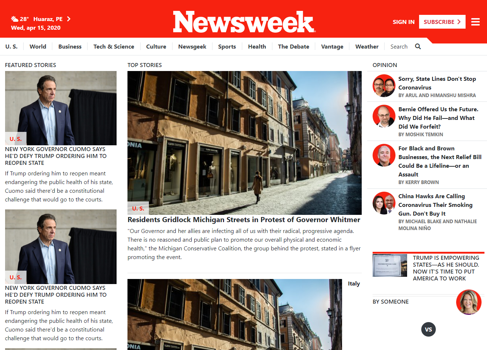

# The Next Web responsive clone

> this is a responsive clone of the The Next Web landing. 

This website contains:

- Every element from the origin website using bootstrap grid layout.

## Built With

- HTML5
- CSS3
- Bootstrap

## Authors

👤 **Luis Mauricio Fow Aranibar **

- Github: [@githubhandle](https://github.com/thedekerone)
- Twitter: [@twitterhandle](https://twitter.com/mauricio_fow)
- Linkedin: [linkedin](https://www.linkedin.com/in/mauricio-fow-aranibar-b2173514b/)

## Getting started

- Clone the repository with:
  `git clone git@github.com:thedekerone/tnw-clone.git`

- See the original page here: https://www.newsweek.com/

- Check the index.html to edit the structure of the page.

- Check the style.css to edit the style of any component.

## 🤝 Contributing

Contributions, issues and feature requests are welcome!

Feel free to check the [issues page](issues/).

## Show your support

Give a ⭐️ if you like this project!

## Live preview

You can check how the website looks in: [Live preview](https://rawcdn.githack.com/thedekerone/News-week-clone/05eeb68bb7644f5470cf34ba0cb5fdb747a161e0/index.html)
